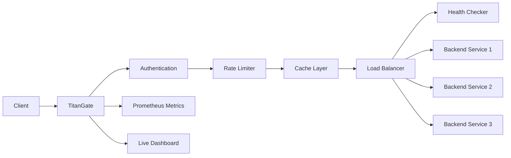

# 🚀 TitanGate API Gateway

> A high-performance, API Gateway built with Go & Fiber, featuring real-time monitoring and intelligent traffic management.

## 🌟 Overview

TitanGate is a modern API Gateway that provides a unified entry point for your microservices architecture. Built with performance and reliability in mind, it offers comprehensive features for traffic management, monitoring, and security.

## ⚡ Core Features

### 🔄 Intelligent Load Balancing
- **Multiple Algorithms**
  - Round-robin distribution
  - Weighted round-robin
  - Least connections
  - Response time-based routing
- **Health Checking**
  - Automatic backend health monitoring
  - Configurable check intervals
  - Failure detection and recovery
  - Health status metrics
- **Connection Management**
  - Active connection tracking
  - Connection pooling
  - Automatic failover
  - Load distribution optimization

### 🛡️ Security & Rate Limiting
- **Rate Limiting**
  - IP-based rate limiting
  - Configurable thresholds
  - Token bucket algorithm
  - Rate limit analytics
- **Authentication**
  - JWT-based authentication
  - Token validation
  - Public endpoint exclusions
  - Configurable token expiry
- **Request Validation**
  - Input validation
  - Schema validation
  - Custom validation rules
  - Detailed error reporting

### 📦 Smart Caching
- **Redis Integration**
  - Distributed caching
  - Configurable TTL
  - Cache invalidation
  - Hit/miss metrics
- **Cache Management**
  - LRU cache implementation
  - Memory optimization
  - Cache warming
  - Cache statistics

### 📊 Real-time Monitoring
- **Metrics Collection**
  - Request counts
  - Response times
  - Cache hit rates
  - Backend health
  - Error rates
- **Prometheus Integration**
  - Custom metrics
  - Histogram tracking
  - Counter metrics
  - Gauge metrics
- **Live Dashboard**
  - Real-time updates
  - Interactive charts
  - Backend status
  - Performance metrics

### 🔢 API Management
- **Versioning**
  - Multiple API versions
  - Header-based routing
  - Path-based versioning
  - Default version fallback
- **Routing**
  - Path-based routing
  - Query parameter routing
  - Header-based routing
  - Custom routing rules

## 🏗️ Architecture



## 🚀 Getting Started

### Prerequisites
- Go 1.21 or higher
- Redis server
- Node.js (for frontend development)

### Installation

1. Clone the repository:
```bash
git clone https://github.com/yourusername/TitanGate.git
cd TitanGate
```

2. Install dependencies:
```bash
go mod download
```

3. Configure environment variables:
```bash
cp .env.example .env
# Edit .env with your configuration
```

4. Start the server:
```bash
go run cmd/api/main.go
```

### Configuration

Key configuration options in `.env`:
```env
PORT=3000
REDIS_URL=redis://localhost:6379
JWT_SECRET=your-secret-key
RATE_LIMIT=100
CACHE_TTL=300
```

## 📊 Dashboard

Access the real-time dashboard at `http://localhost:3000`:
- System overview
- Backend health status
- Request metrics
- Cache statistics
- Rate limiting status

## 🔧 API Endpoints

### Management API
- `GET /api/v1/backends` - List all backends
- `GET /api/v1/metrics` - Get system metrics
- `GET /health` - Health check endpoint
- `GET /metrics` - Prometheus metrics

### Monitoring
- Real-time request tracking
- Backend performance metrics
- Cache hit/miss rates
- Rate limit statistics

## 🛠️ Development

### Project Structure
```
TitanGate/
├── cmd/
│   └── api/
│       └── main.go
├── internal/
│   ├── cache/
│   ├── loadbalancer/
│   ├── metrics/
│   ├── middleware/
│   └── services/
├── static/
│   ├── css/
│   └── js/
└── go.mod
```

### Adding New Features
1. Create new package in `internal/`
2. Implement interfaces
3. Add tests
4. Update documentation

## 📈 Performance

- Sub-millisecond latency
- High throughput
- Efficient memory usage
- Scalable architecture

## 🔒 Security

- JWT authentication
- Rate limiting
- Input validation
- Secure headers
- CORS support

## 🤝 Contributing

1. Fork the repository
2. Create your feature branch
3. Commit your changes
4. Push to the branch
5. Create a Pull Request

## 📝 License

This project is licensed under the MIT License - see the [LICENSE](LICENSE) file for details.

## 🙏 Acknowledgments

- [Fiber](https://github.com/gofiber/fiber) - Fast web framework
- [Redis](https://redis.io/) - In-memory data store
- [Prometheus](https://prometheus.io/) - Monitoring system
- [Chart.js](https://www.chartjs.org/) - Charting library
